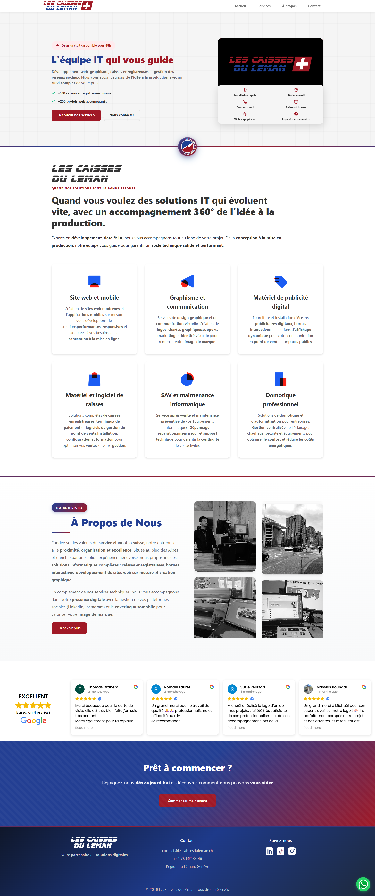

<div align="center">

# 🌐 Les Caisses du Léman - Landing Page 🎨

### 🛠️ Réalisé avec **React 18**, **Vite**, **SCSS (Sass)** & **Docker**

---

### 💼 Mission du projet

🖊️ Cher visiteur,  

Ce projet représente une **landing page moderne et professionnelle**, conçue pour présenter les services IT de **Les Caisses du Léman** : développement web, graphisme, caisses enregistreuses et gestion des réseaux sociaux.

🎯 L'objectif ?  
👉 Créer une vitrine digitale **responsive**, **esthétique** et **optimisée**, inspirée des Alpes suisses et de la région du Léman.  
Une application React moderne avec **Vite** pour la rapidité, du **SCSS** pour un style maîtrisé, et une architecture **Docker** pour un déploiement simplifié.

✨ Pensé pour impressionner par le design et la fluidité, cette landing page met en valeur l'expertise technique et la proximité client de l'entreprise, avec une identité visuelle forte aux couleurs suisses (bleu #0055A4 et rouge #DC143C).

<br>



</div>

---

## 🚀 Fonctionnalités

- 💎 **Design 100% responsive** (mobile, tablette, desktop)  
- 🎨 **SCSS** utilisé pour une meilleure organisation des styles  
- ⚛️ **React 18** avec hooks personnalisés (useMenu, useTrustindex)  
- 🎬 **Vidéo promotionnelle interactive** dans la section hero  
- 🖼️ **Galerie d'images animée** dans la section à propos  
- ⭐ **Intégration Trustindex** pour les avis Google  
- 📄 **Téléchargement de catalogue PDF**  
- 💬 **Bouton WhatsApp flottant** pour contact direct  
- 🎯 **Navigation fluide** avec menu burger pour mobile  
- 🎨 **Animations CSS subtiles** et efficaces  
- 🐳 **Containerisation Docker** pour déploiement simplifié  
- 🚀 **Build optimisé** avec Vite pour des performances maximales

---

## 🛠️ Installation & Lancement

### 📦 Installation

```bash
# Cloner le projet
git clone https://github.com/TonPseudo/LESCAISSESDULEMAN.git
cd LESCAISSESDULEMAN

# Installer les dépendances
npm install
```

### 💻 Développement

Lance le serveur de développement :
```bash
npm run dev
```

La page sera accessible sur `http://localhost:5173` 🎉

### 🏗️ Build de production

Pour créer une version de production :
```bash
npm run build
```

Les fichiers seront générés dans le dossier `dist/`

### 📦 Prévisualisation

Pour prévisualiser la version de production :
```bash
npm run preview
```

### 🐳 Déploiement avec Docker

Build de l'image Docker :
```bash
docker build -t lescaissesduleman-web .
```

Lancement avec Docker Compose :
```bash
docker-compose up -d
```

L'application sera accessible sur `http://localhost:5000`

Arrêt des conteneurs :
```bash
docker-compose down
```

---

## 📁 Arborescence du projet

```bash
├── public/
│   └── assets/
│       ├── doc/
│       │   └── catalogue-lescaissesduleman.pdf
│       ├── icons/
│       │   └── [icônes des services et réseaux sociaux]
│       ├── imgs/
│       │   └── [images et logos]
│       └── video/
│           └── LESCAISSESDULEMAN.mp4
├── src/
│   ├── composants/
│   │   ├── useMenu.js
│   │   └── useTrustindex.js
│   ├── pages/
│   │   └── LandingPage.jsx
│   ├── styles/
│   │   ├── base/
│   │   │   ├── _reset.scss
│   │   │   ├── _typography.scss
│   │   │   └── _variables.scss
│   │   ├── components/
│   │   │   ├── _google-reviews.scss
│   │   │   └── _landing-page.scss
│   │   └── main.scss
│   ├── App.jsx
│   └── main.jsx
├── docker-compose.yml
├── Dockerfile
├── nginx.conf
├── vite.config.js
└── package.json
```

---

## 🎨 Technologies utilisées

- **React 18** - Bibliothèque JavaScript pour l'interface utilisateur
- **Vite** - Build tool et serveur de développement ultra-rapide
- **SCSS (Sass)** - Préprocesseur CSS pour un style structuré
- **Docker** - Containerisation de l'application
- **Nginx** - Serveur web pour la production
- **Trustindex** - Intégration des avis Google

---

## 🇨🇭 Inspiration & Design

Le design s'inspire de :
- 🏔️ La région du Léman (lac entre la Suisse et la France)
- ⛰️ Les Alpes suisses
- 🏦 La tradition bancaire suisse
- 🎨 Les couleurs du logo officiel (Bleu #0055A4, Rouge #DC143C)

---

## 📱 Responsive Design

La page est entièrement responsive et s'adapte à tous les écrans :
- 💻 **Desktop** : Expérience complète avec toutes les fonctionnalités
- 📱 **Tablette** : Adaptation des grilles et navigation optimisée
- 📱 **Mobile** : Menu burger, images optimisées, boutons tactiles

---

## 📞 Contact

- 📧 **Email** : contact@lescaissesduleman.ch
- 📞 **Téléphone** : +41 78 662 34 46
- 📍 **Localisation** : Région du Léman, Genève

## 🔗 Réseaux sociaux

- [Instagram](https://www.instagram.com/lescaissesduleman)
- [TikTok](https://www.tiktok.com/@lescaissesduleman)
- [LinkedIn](https://www.linkedin.com/company/lescaissesduleman)

---

## 🙌 Remerciements

Merci d'avoir pris le temps de consulter ce projet !  
Cette landing page est un bon exemple de ce qu'on peut faire avec **React**, **Vite**, **SCSS** et une architecture **Docker** bien maîtrisée.

<div align="center">
⭐ Un petit like sur le repo fait toujours plaisir ! ⭐  
Et n'hésite pas à le forker ou t'en inspirer pour tes propres projets.
</div>

---

## 📄 Licence

© 2026 Les Caisses du Léman. Tous droits réservés.
